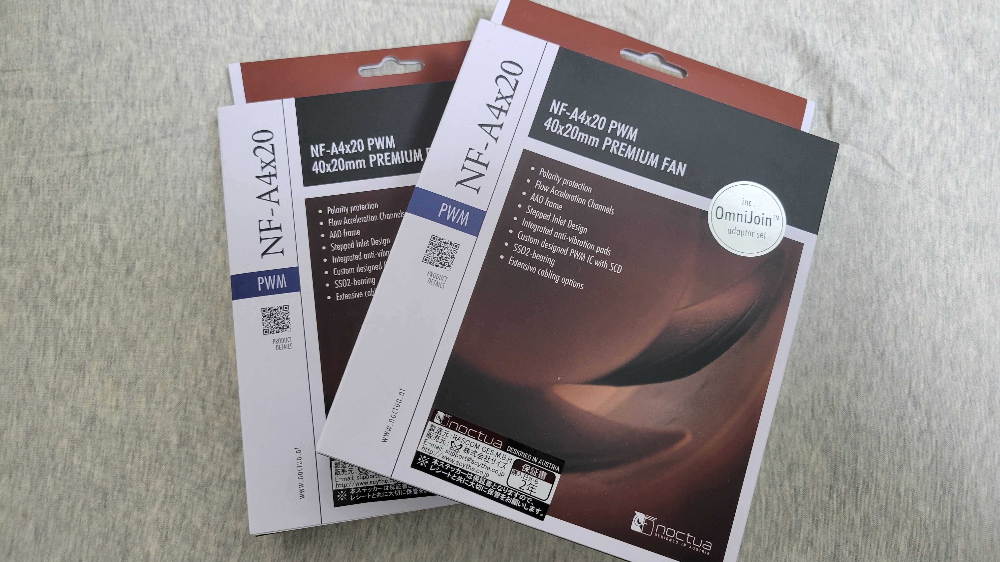
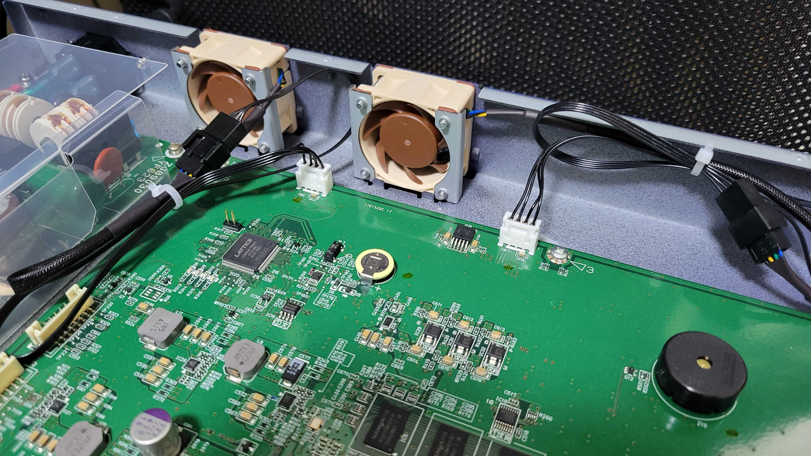
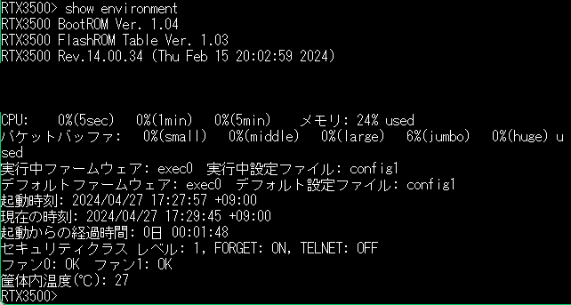

## はじめに
某オークションでYAMAHAのルータであるRTX3500を手に入れた．  
今までYAMAHA RTX1210をメインで使用していたのでリプレースを行った．  
RTX3500を自宅で導入する上で弊害となるのが，騒音である．というのも，仕様上ほぼフルスピードで回っているらしい[要出典]． 
そんな訳で，静音化を行った． 
あと，最後におまけとしてzabbix6.0でSNMPを用いて監視をするためのテンプレートを置いている．

## 静音化の手順
静音化をご自身で行う場合は，自己責任でお願いします！  
### 1. ファンを購入
もともと付いていたのは，SANYO DENKI製の40×40×20のPWM制御ファン「9GA0412P6H007」であった．  
12V駆動，最大0.1Aの仕様であったので，最大電流がこれ以下の同サイズ12Vファンを探した．  
そんなわけで，今回はNoctua製の「NF-A4×20 PWM」を購入した．  
後述するが，コネクタに互換性がないので，コネクタ作成用の4pinファンケーブル延長ケーブル2本も購入した．  

    
    1個2050円．それを2個なので4100円．学生にとってはリッチなファンである... 

  
  
### 2. コネクタ作成
物が届いたらそのまま使用したいところだが，その前にコネクタ加工が必要である．  
というのも，NoctuaのファンはPCによく使われる4pinケーブルなのだが，RTX3500側のコネクタは4pinのXHコネクタである．[XHコネクタについてはこちらを参照．](https://www.jst-mfg.com/product/index.php?series=277)  
  
今回は，Noctuaファンに加工するのは嫌だったため延長ケーブルを別途購入し，そちらを切断・圧着を行った． 
コネクタは何でもいいが，ヨドバシをパーっとみて安かったainex製「CA-099A」を購入した．(予算があるなら，もう少し太い線のものの方が圧着しやすいかもしれない．)  
これを切って，ピンアサインを間違えないように圧着した．

  
ピンアサインに関して，RTX1300の静音化などの記事でPWMの制御ピンとセンサ用のピンを一緒にしないとアラートが消えない等の記事を見たが，RTX3500に関しては，そのような現象はなかった．  
これに関しては，そもそも回転数を読んでない説もある．[要検証]

### 3. 取り付け
ラックマウント用の耳を外して（あれば），ネジを外して蓋をあけ，既存のファンを取って差し替えるだけのカンタンなお仕事です．  
取り付けると以下のような感じ．おしゃれな感じにできた．
 

    
    ケーブルが長いのと，圧着が下手なのは御愛嬌．

  
## 静音化を終えて
`show environment`コマンドで状態の確認を行うと以下の出力を得た．  

    

下から三行目，ファン0・ファン1ともにOKのステータスになっている．   
動作音も全くわからないぐらいに静かになっており，数時間運用してみたが温度も正常な温度で一定になった．  
静音化は成功し，今後，寝食を共にできそうである．

## おまけ：zabbixで監視をした
もともとRTX1210の監視をしていたので，テンプレートを改変してRTX3500にも対応した． 
テンプレートファイルや使い方は[Githubを参照](https://github.com/mame7777/ZabbixTemplate-YAMAHA-RTX3500)． 
なお，lan4に関する項目を消すと，RTX1210にも使用できる．